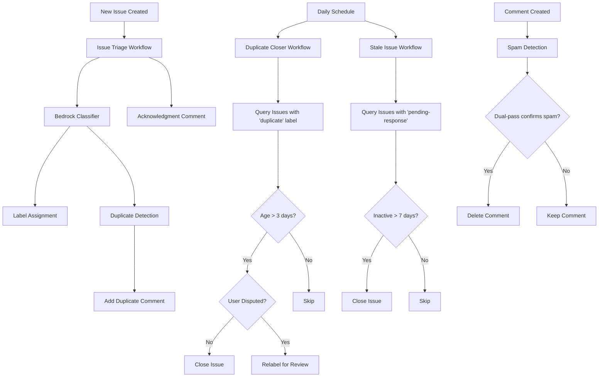

# Design Document: MiForge GitHub Issue Automation

## Overview

This design describes an automated GitHub issue management system for MiForge that leverages AWS Bedrock's Claude models for intelligent issue classification, duplicate detection, and lifecycle management. The system consists of multiple GitHub Actions workflows that work together to maintain a clean, well-organized issue tracker.

The automation handles four primary workflows:
1. **Issue Triage** - Automatically labels new issues and detects duplicates
2. **Duplicate Closure** - Closes confirmed duplicate issues after a grace period
3. **Stale Issue Management** - Closes inactive issues awaiting user response
4. **Spam Detection** - AI-powered dual-pass spam comment removal

## Architecture

### High-Level Architecture



### Component Architecture

1. **GitHub Actions Workflows** - Orchestration layer that triggers on events and schedules
2. **Bedrock Integration Module** - TypeScript module that interfaces with AWS Bedrock API
3. **Label Assignment Module** - Analyzes AI output and applies appropriate labels
4. **Duplicate Detection Module** - Compares issues and identifies duplicates
5. **Issue Lifecycle Manager** - Handles closing of duplicate and stale issues
6. **Spam Detection Module** - AI-powered comment spam detection with dual-pass confirmation
7. **Comment Generator** - AI-generated personalized acknowledgment comments

## Components and Interfaces

### 1. Issue Triage Workflow

**File:** `.github/workflows/issue-triage.yml`

**Trigger:** `issues` event with `opened` action

**Responsibilities:**
- Fetch issue details (title, body, labels)
- Call Bedrock Classifier with issue content
- Parse AI response for label recommendations
- Apply labels to the issue
- Detect and comment on potential duplicates
- Post AI-generated acknowledgment comment

### 2. Bedrock Classifier Module

**File:** `scripts/bedrock_classifier.ts`

**Interface:**
```typescript
async function classifyIssue(
    issueTitle: string,
    issueBody: string,
    labelTaxonomy: LabelTaxonomy
): Promise<ClassificationResult>
```

**Configuration:**
- Model ID: `us.anthropic.claude-opus-4-6-v1` (inference profile)
- Max tokens: 2048
- Temperature: 0.3 (for consistent classification)

### 3. Duplicate Detection Module

**File:** `scripts/detect_duplicates.ts`

**Interface:**
```typescript
async function detectDuplicates(
    newTitle: string,
    newBody: string,
    owner: string,
    repo: string,
    currentIssueNumber: number,
    githubToken: string
): Promise<DuplicateMatch[]>
```

**Strategy:**
1. Fetch all open issues from the repository
2. Filter to triaged issues + recent untriaged (configurable window)
3. Use Bedrock for semantic similarity analysis in batches of 10
4. Return matches with similarity score > 0.80
5. Sort by similarity score (highest first)

### 4. Label Assignment Module

**File:** `scripts/assign_labels.ts`

**Features:**
- Validates labels against taxonomy (max 3 non-workflow labels)
- Always adds "pending-triage" for new issues
- Adds "duplicate" label when duplicates detected
- Removes "pending-triage" when "duplicate" is added

### 5. Spam Detection Module

**File:** `scripts/delete_spam_comments.ts`

**Features:**
- Dual-pass AI verification (95%+ confidence required from both)
- Org member bypass
- Full audit logging
- Conservative approach (false negatives preferred over false positives)

## Data Models

### ClassificationResult
```typescript
interface ClassificationResult {
    recommended_labels: string[];
    confidence_scores: Record<string, number>;
    reasoning: string;
    error?: string;
}
```

### DuplicateMatch
```typescript
interface DuplicateMatch {
    issue_number: number;
    issue_title: string;
    similarity_score: number;
    reasoning: string;
    url: string;
}
```

### LabelTaxonomy
```typescript
class LabelTaxonomy {
    feature_component: string[];
    os_specific: string[];
    theme: string[];
    workflow: string[];
    special: string[];
}
```

## Error Handling

### API Error Handling

- **Bedrock API**: Retry with exponential backoff (1s, 2s, 4s), model fallback chain
- **GitHub API**: Rate limit checking, retry with backoff, batch processing
- **Graceful degradation**: Continue without AI if all retries fail

### Workflow Error Handling

- Process issues independently (fault isolation)
- Track failed issues in workflow summary
- Individual failures don't stop the entire batch

## Security

- Input sanitization for prompt injection protection
- Maximum length enforcement for all user inputs
- Dangerous pattern detection and redaction
- Org member verification for spam detection bypass
- AWS credentials stored in GitHub Secrets only
