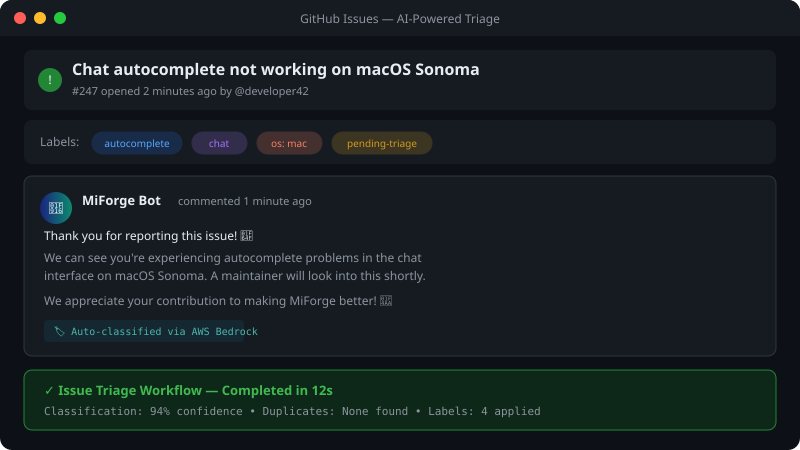
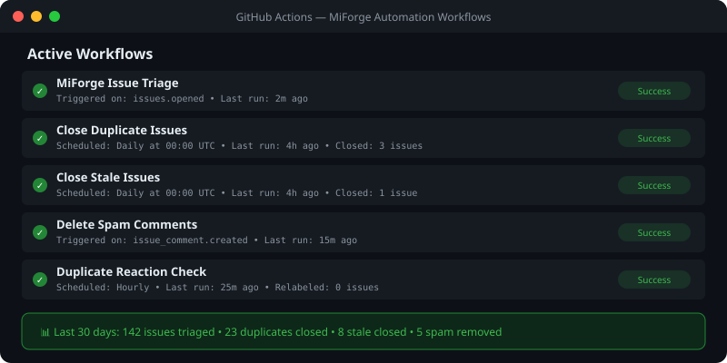
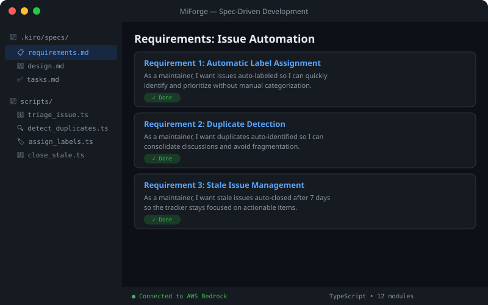
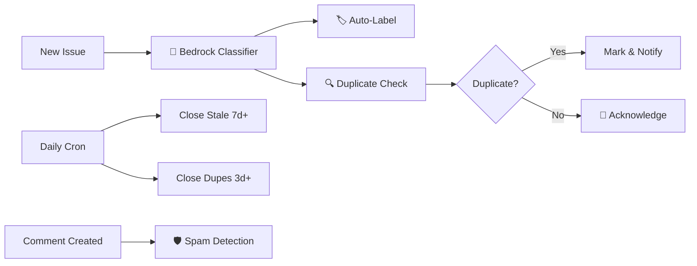

  

  
  
  
  
  

---

## 🚀 What is MiForge?

MiForge is an agentic IDE and command-line interface by **MiLyfe** that helps you go from prototype to production with spec-driven development, agent hooks, powers, and natural language coding assistance. Build faster with AI-powered features that understand your entire codebase, turn prompts into structured specs, and automate repetitive tasks.

---

## ✨ Core Capabilities

| Feature | Description |
|---------|-------------|
| 📋 **Specs** | Plan and build features using structured specifications that break down requirements into implementation plans |
| ⚡ **Hooks** | Automate repetitive tasks with intelligent triggers that respond to file changes and events |
| 💬 **Agentic Chat** | Build features through natural conversation with MiForge that understands your project |
| 🎯 **Steering** | Guide MiForge's behavior with custom rules and project-specific context |
| 🔌 **MCP Servers** | Connect external tools and data sources through the Model Context Protocol |
| 🔮 **Powers** | Specialized context and tools for agents on-demand with domain-specific knowledge |
| 🔒 **Privacy First** | Enterprise-grade security and privacy for your code |

---

## 📸 Live Preview

### AI-Powered Issue Triage

When a new issue is opened, MiForge's AI automatically classifies it, assigns labels, and posts an acknowledgment:

---

### Automated Workflow Dashboard

All automation workflows running continuously to keep your issue tracker clean:

---

### Spec-Driven Development

Structure your features with formal requirements, design documents, and tracked implementation tasks:

---

## 🛠️ Available Interfaces

### MiForge IDE (Desktop Application)

The standalone desktop application is available for:
- 🍎 **macOS** — Intel & Apple Silicon
- 🪟 **Windows** — x64
- 🐧 **Linux** — x64 & ARM

### MiForge CLI

Command-line interface for integrating MiForge into your development workflows and automation scripts.

For detailed information on both interfaces, visit [miforge.dev](https://miforge.dev)

---

## 🚦 Getting Started

### Download & Install

**IDE:** Download the MiForge desktop application directly from [miforge.dev](https://miforge.dev)

**CLI:** Instructions for installing the MiForge CLI are available in our [documentation](https://miforge.dev/cli)

### First Project

Get started with MiForge by following our comprehensive **[first project guide](https://miforge.dev/docs/getting-started/first-project/)**:

- 📝 Setting up steering files for project-specific guidance
- 📋 Creating and managing specs for structured development
- ⚡ Configuring hooks to automate your workflow
- 🔌 Connecting MCP servers for external integrations

### One-Click Migration
Import your VS Code setup including extensions and settings during the initial setup process.

---

## 🤖 Issue Automation Architecture

MiForge includes a complete AI-powered issue management system:

| Workflow | Trigger | What It Does |
|----------|---------|-------------|
| **Issue Triage** | Issue opened | AI classifies, labels, detects dupes, posts comment |
| **Close Duplicates** | Daily cron | Closes confirmed dupes after 3-day grace period |
| **Close Stale** | Daily cron | Closes inactive issues after 7 days |
| **Spam Detection** | Comment created | Dual-pass AI verification, deletes with 95%+ confidence |
| **Dispute Handler** | Comment on dupe | Relabels issue for maintainer review |
| **Reaction Check** | Hourly | Checks 👎 reactions on dupe comments |

---

## 📚 Documentation

**[📚 View Documentation →](https://miforge.dev/docs/)**

- [Getting Started](https://miforge.dev/docs/getting-started) — Installation and first project setup
- [IDE Guide](https://miforge.dev/docs/) — Desktop application features and workflows
- [CLI Guide](https://miforge.dev/docs/cli) — Command-line interface usage and automation
- [Scripts README](scripts/README.md) — Automation scripts API documentation
- [Workflows README](.github/workflows/README.md) — GitHub Actions setup guide

---

## 🐛 Issue Reporting

We welcome feedback and issue reports to help improve MiForge. Please use this repository to:
- Report bugs and technical issues
- Request new features
- Share feedback on existing functionality
- Discuss improvements and enhancements

---

## 💬 Support

| Channel | Purpose |
|---------|---------|
| [Discord](https://discord.gg/milyfe) | Community help & discussions |
| [MiLyfe Support](https://support.milyfe.com/) | Technical assistance |
| [Billing Support](https://support.milyfe.com/billing) | Billing-related questions |

---

## 🔒 Security

If you discover a potential security issue in this project we ask that you notify MiLyfe Security via our [vulnerability reporting page](https://milyfe.com/security/vulnerability-reporting). Please do **not** create a public GitHub issue.

## 📜 Code of Conduct

This project has adopted the [MiLyfe Open Source Code of Conduct](https://milyfe.com/code-of-conduct).
For more information see the [Code of Conduct FAQ](https://milyfe.com/code-of-conduct-faq) or contact
opensource@milyfe.com with any additional questions or comments.

---

  **Built with 🔨 by MiLyfe**

  ©2026 MiLyfe, Inc. All Rights Reserved.

